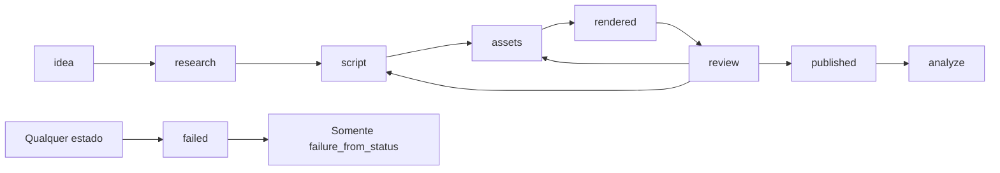

# Auditoria de arquitetura — CONTENT AI

Data: 2026-09-11. Base: `d19c6ea`. Critério: **Bloqueante** impede compilar/deployar/executar o fluxo solicitado; **Alta** afeta segurança, custo, integridade ou conformidade; **Média** limita confiabilidade/qualidade; **Baixa** manutenção/documentação. “Corrigido” indica mudança no repositório, não validação cloud.

## Veredito

Concordância parcial com as sugestões externas: preservar módulos existentes e priorizar execução real está correto. “Deixar zero bloqueantes” não autoriza declarar como implementados publishers inexistentes ou considerar aprovada uma API externa. Foram realizadas correções no código existente e na ligação até `review`; o pipeline completo **ainda não está pronto para publicação automática**.

Isto já existe em `packages/core/src/schemas/script-json.ts`: contrato Zod e invariantes. Não recriado em um `script-validator.ts` paralelo. Isto já existe em `packages/core/src/planners/asset-plan.ts`: planejamento por role. Isto já existe em `apps/local-renderer/src/render.ts`: renderer de produção e desenvolvimento. Os três módulos foram preservados.

## Eixo 1 — Arquitetura

### Revisão individual dos ADRs

| ADR real | Veredito | Evidência / ajuste |
|---|---|---|
| 001 arquitetura | Aprovado com ressalvas | Monorepo, RLS e stack adequados. Free tier de imagem e “heartbeat garante não pausar” não são garantias. Painel é stub. |
| 002 estados | Correção necessária | Trigger existia, mas não exigia aprovação; inserção podia começar em qualquer estado; retry saltava checkpoints. Corrigido pelo 015. |
| 003 TTS | Correção necessária | Gemini funcional; endpoints Edge/Piper não provisionados. Fallback movido para Actions, autorizado pelo operador. |
| 004 Actions | Aprovado com correções | Um único renderer e apenas UUID no dispatch estão corretos. Reserva/POST tinham corrida e timeout ambíguo; agora lease + reserva anterior. |
| 005 contrato | Aprovado com emendas | Contrato estagiado correto. Empty-array crash, IDs duplicados e contagem de tags corrigidos; lacunas semânticas abaixo. |
| 006 áudio manda | Aprovado | Duração real + gap; regeneração integral ao mudar engine. Os checkpoints agora são realmente por cena. |
| 007 fila/nicho | Aprovado com correções | SKIP LOCKED correto; cap diário fora da transação era vulnerável. RPC agora serializa o cap. Bot ainda ausente. |
| 008 research/script | Aprovado com ressalvas | Separação evita refazer pesquisa em repair; preservada. Restrição grounding+schema não deve ser generalizada para modelos futuros. Repair agora inclui JSON malformado. |
| 009 imagens | Aprovado com correções | Roles reais são hook/content/cta; não inventar claim/counterpoint/disclosure. Nano Banana desabilitado de forma efetiva; falha de imagem afiliada cai em Pexels. |
| 010 legendas | Aprovado com ressalvas | Sem Whisper; timing proporcional é aproximação, não forced alignment acústico. ASS atual mostra grupos de palavras, não destaque progressivo individual. |
| 011 renderer | Aprovado com correções | Checkpoints e concat corretos; namespace agora acompanha inputs. Música respeita volume. Motion/transition ainda precisam implementação fiel. |
| 012 assets + TTS | Correção necessária | Chamada monolítica e endpoints ausentes comprometiam execução. Handler reaproveitado, trabalho em unidades e fallback Actions. |
| 013 deploy | Correção necessária | Reserved secrets, cron diário sem encadeamento e smoke insuficiente. `--check`, smoke seguro, migração aditiva e verificador adicionados. |
| 014 | Não auditável | Arquivo não existe nessa revisão; não foi fabricado nem declarado aprovado. |

### Máquina de estados observada e corrigida

Estado representa etapa **concluída**: `research` contém pesquisa; `script` contém roteiro; `assets` precisa imagens, áudio e legendas. O código liga agora `idea → ... → rendered → review`; `review → published → analyze` continua dependente dos módulos do plano. Retry não substitui validação de payload: um service worker ainda precisa validar schemas antes de cada efeito externo.

| ID | Severidade | Achado / evidência inicial | Resultado |
|---|---|---|---|
| A01 | Bloqueante | `orchestrator/index.ts` criava episódios sem chamar próxima etapa. | Corrigido até review em `_shared/advance-pipeline.ts`; uma etapa por tick, pipeline inicialmente pausado. |
| A02 | Alta | Trigger aceitava insert em estado avançado, retry para review e publicação sem aprovação. | Corrigido na migration 20260911; origem do failed, gate e eventos transacionais. |
| A03 | Bloqueante | `generate-assets` podia exceder 150s com várias chamadas TTS; registros só ao final do lote. | Imagem/áudio/pre-flight separados por checkpoint 202; lease de 180s; Gemini com timeout de 30s e um retry. Validar latência hospedada ainda necessário. |
| A04 | Alta | Fallback TTS era apenas URL opcional não provisionada. | Runner Edge/Piper implementado, modelo provisionado por script e checksums. Falta comprovar execução integrada com Storage cloud. |
| A05 | Alta | `trigger-render` fazia POST antes de reservar dispatch e podia repeti-lo após timeout. | Reserva anterior sob lease; sem retry cego de POST, TTL e teto de tentativas. Exactly-once externo não é prometido. |
| A06 | Alta | Refazer podia reutilizar intermediários antigos com nomes fixos. | Hash de inputs/config e geração na chave de checkpoint; aprovação/output invalidados na refação. |
| A07 | Média | `scriptJsonSchema.safeParse` lançava TypeError com zero cenas; IDs não eram únicos. | Corrigido com testes. |
| A08 | Média | JSON malformado abortava repair e research sem estado de falha coerente. | Parse de script entra no repair limitado; research malformado registra falha, sem repetir grounding para reparar JSON. |
| A09 | Alta | OpenRouter, QA/fact-checker, aprovação, publicação e analytics não existem. | **Pendente de implementação**; sequência e critérios no plano. Não são substituídos por stubs que publiquem sem validação. |
| A10 | Média | Renderer ignora `transition`/`ken_burns`, usando zoom-in para todas as cenas; ASS é agrupado. | **Pendente**: implementar movimentos/trocas sem mudar duração do áudio e destaque por palavra. Volume de música e rollover ASS corrigidos. |
| A11 | Média | `isRenderReady` só verifica imagens; hash não impede duplicação de upload externo. | Helper preservado como gate visual; handler verifica áudio/legendas. Publisher precisa ledger por plataforma/formato e reconciliação remota. |

### Contrato: cobertura e omissões

Não existem “8 regras” isoladas: schema e `superRefine` acumulam constraints dos ADRs 005/006/008/010. Cobrem UUID/semver, 3–8 cenas, target 5–45s, soma 60–600s (teto efetivo 360s), orders, roles, assets nulos até resolução, fontes, disclosure e limites de metadata. Isso valida forma, não verdade factual.

| Consumidor | Cobertura existente | Falta fechar |
|---|---|---|
| generate-script | JSON estruturado, repair, normalização de campos de sistema e hash | Conferir sources contra evidências de research; coerência full_text vs narrações; disclosure realmente narrado no CTA; fact-check determinístico. |
| generate-assets | imagens por role, áudio real, engine única, metadata por cena/orientação | Fingerprint explícito de voz/config em cada recurso; verificação de objeto removido no Storage; fallback stock semanticamente adequado ao produto. |
| renderer | imagens no script; áudio/legendas em tabela; duas proporções | Motion/transition; limitar tamanho final e duração por destino; orçamento de retenção. |
| publish | títulos, descrições, tags, sources/disclosures | Mapear category para categoryId; variante long/Short; privacidade/consentimento; descrição com links/atribuições; ledger único e uploads retomáveis. |

Não adicionar áudio/binários ao hash editorial. Schema de publicação deve ser separado do contrato editorial, derivando flags e recusando conteúdo sem aprovação e QA.

## Eixo 2 — Custo e quota

| ID | Severidade | Achado | Correção / pendência |
|---|---|---|---|
| B01 | Alta | “50–100 Gemini/dia” tratado como limite universal; chamadas simultâneas e retries não contabilizados. | Reservas atômicas por tentativa, categoria, modelo e minuto; reset Pacific. Tetos reais devem ser confirmados no AI Studio; TPM ainda pendente. |
| B02 | Alta | Flag poderia ativar geração de imagem paga. | Geração de imagem recusada na RPC e desabilitada no planner runtime. Pexels/produto autorizados mantidos. |
| B03 | Média | 900 min calculados como garantia e atribuídos a Pro+. | Conta corrigida e condicionada ao tempo total de cada job e número de formatos. Repo público confirmado por `gh repo view`. |
| B04 | Alta | Sem controle efetivo de ocupação/retenção de Storage ou tamanho do MP4. | **Pendente**: orçamento em bytes, upload dentro de 50MB e expurgo seguro pós-publicação. CI mede somente fixture curta. |
| B05 | Média | OpenRouter “1.000/dia” sem conferir elegibilidade. | **Pendente**, pois cliente não existe. Limite inicial sem comprovação deve ser 50/dia, somente modelos gratuitos. Não foi feito depósito. |
| B06 | Alta | Seed/calendário poderiam iniciar chamadas antes da verificação. | `pipeline.enabled=false` por padrão; consumo diário atômico; três dispatches automáticos por etapa antes de falhar. |

Para **N=3–8 cenas**, sem retries: research=1 grounding, script=1 texto (2 com repair), TTS=N+1 com pre-flight. Total Gemini=**N+3 → 6–11** (7–12 com repair), imagem=0 no perfil gratuito. Dois episódios: **12–22**, ou até24 com repair. Com um retry de transporte por chamada, teto teórico dobra; regeneração/pre-flight repetido também consome. No seed, TTS usa teto interno de10/dia por modelo: dois episódios de8 cenas não cabem integralmente em Gemini e devem usar o fallback. QA e metadata OpenRouter hoje consomem **zero porque não existem**; planejar 1 QA + 1 metadata por episódio e reservas por tentativa.

Gemini mede RPM, TPM e RPD por projeto/modelo; RPD reseta à meia-noite Pacific. A página de preços consultada mostra Flash TTS gratuito e Flash Image sem free tier de API. [Limites Gemini](https://ai.google.dev/gemini-api/docs/rate-limits), [preços Gemini](https://ai.google.dev/gemini-api/docs/pricing).

OpenRouter documenta 50 requests gratuitos/dia, ou 1.000 após compra acumulada de pelo menos10 créditos; isso não transforma modelos pagos em gratuitos nem garante capacidade. [FAQ OpenRouter](https://openrouter.ai/docs/faq).

Actions: `2 × 15 × 30 = 900` minutos; mês de31 dias=930. Se “dois vídeos” significa dois episódios com dois formatos cada, os15min precisam incluir ambos os encodes. Pior caso atual: `2 × (30 render + 15 fallback TTS) × 31 = 2.790` minutos, antes de retries/CI. Runners padrão em repositórios públicos são gratuitos; para privado, GitHub Pro inclui3.000 e Free2.000. Isso é independente do Copilot Pro+. [GitHub Actions billing](https://docs.github.com/en/billing/concepts/product-billing/github-actions).

Storage é o limite provavelmente mais cedo: Free limita objeto a50MB e inclui1GB de armazenamento; também há egress. Exemplo **estimado**, não benchmark: cada orientação de120s a2,2Mbit/s total ≈33MB; duas finais + intermediários equivalentes ≈132MB/episódio, sem áudios. Cerca de7 episódios ocupariam perto de1GB. Reuso de checkpoints baixa minutos, mas mantém cópias extras. [Limite por arquivo](https://supabase.com/docs/guides/storage/uploads/file-limits), [plano Supabase](https://supabase.com/pricing).

## Eixo 3 — Segurança e conformidade

| ID | Severidade | Achado | Resultado |
|---|---|---|---|
| S01 | Alta | `.env.cloud` não era ignorado. | `.env.*` ignorado com exceção explícita do exemplo; scan no código e histórico sem achados de padrões conhecidos. |
| S02 | Alta | Workers confiavam só no JWT do gateway: anon/user JWT também podem ser válidos. | `requireServiceRole` em cada handler, antes de acesso ao banco. Testes rejeitam ausência, anon e user. |
| S03 | Alta | Funções RPC sem restrição explícita de execução. | Revokes PUBLIC/anon/authenticated e grants service_role para consumo, lease e reservas. RLS permanece ligado sem policies públicas nas tabelas da aplicação. |
| S04 | Alta | Imagem afiliada baixada de qualquer URL, com limite só depois de ler tudo. | Allowlist HTTPS, sem redirects/credenciais, MIME raster e leitura limitada. Autorização de direitos explícita. |
| S05 | Alta | Disclosures presentes no JSON mas sem travas correspondentes no banco/publicação. | Banco agora exige sintético e comercial; **mapeamento e exposição nas plataformas pendentes** dos publishers. |
| S06 | Bloqueante para TikTok automático | Premissa de que basta aguardar auditoria da Content Posting API. | **Veto arquitetural à promessa**: manter TikTok manual; restrição de uso privado conflita com o produto atual. Não implementar workaround de compliance. |
| S07 | Alta | Conteúdo em massa sem QA de originalidade/evidência pode não monetizar no YouTube. | **Pendente**: gate editorial, demonstração/análise própria, diversidade substancial e verificação de fontes. Não há garantia de monetização só por ser conteúdo gerado. |
| S08 | Alta | Webhook Telegram/anti-spoof não implementados. | **Pendente**: secret_token, allowlist de chat/user, dedup por update_id e callback associado ao render aprovado. |

Bucket público significa que qualquer pessoa com a URL lê os objetos, inclusive drafts; isso **não equivale a autorização para escrever**. A migration cria bucket público, e escrita segue serviço/RLS. A validação real de Storage e possíveis policies herdadas do projeto exige smoke cloud. Service role aparece só em backend/runtime e GitHub Secrets; não há client web implementado. [Buckets públicos](https://supabase.com/docs/guides/storage/buckets/fundamentals), [autenticação Edge](https://supabase.com/docs/guides/functions/auth).

YouTube: conteúdo repetitivo ou produzido em massa sem valor original pode ser inelegível à monetização; “canal dark” ou voz sintética não resolvem essa exigência. Publisher deve enviar `status.containsSyntheticMedia`, além de metadata/commercial disclosure apropriados; a política de paid promotion deve ser analisada conforme a relação comercial, não presumida equivalente a um boolean interno. [Políticas de monetização](https://support.google.com/youtube/answer/1311392), [recurso videos](https://developers.google.com/youtube/v3/docs/videos).

TikTok: a documentação exclui utilitário privado para upload nas contas do próprio operador/equipe; também exige interface com escolha/consentimento do criador. Logo, a auditoria não pode ser tratada como etapa burocrática de aprovação garantida. TikTok Shop/afiliados também não são automaticamente habilitados pela Content Posting API. [Content Sharing Guidelines](https://developers.tiktok.com/doc/content-sharing-guidelines/).

YouTube ainda exige credenciais OAuth e canal de destino; uploads de projetos de API não auditados podem ficar restritos a privado. Um teste privado não prova habilitação pública. [videos.insert](https://developers.google.com/youtube/v3/docs/videos/insert).

## Eixo 4 — Prontidão e execução

| ID | Severidade | Situação | Fechamento |
|---|---|---|---|
| D01 | Bloqueante | Comandos raiz falhavam: Turbo sem packageManager; renderer tinha rootDir incompatível com fontes workspace. | Corrigidos. Zod alinhado exatamente entre Node/Deno; Node mínimo22.15. |
| D02 | Bloqueante | Deploy tentava criar secrets reservados e não verificava migrations. | Corrigido no script; validar CLI/autenticação cloud ainda necessário. |
| D03 | Bloqueante | Supabase/Storage/Vault/cron e GitHub Secrets não configurados nesta tarefa. | **Externo pendente**: não há credenciais Supabase no ambiente; consulta GitHub retornou lista vazia de secrets. |
| D04 | Alta | CI não verificava entrypoints completos nem renderer. | CI expandido: Deno, Node, SQL/concorrência, FFmpeg real e Piper. |
| D05 | Bloqueante para pipeline completo | Aprovação, publishers e analytics ausentes. | **Implementação pendente**, detalhada no plano. Preflight production bloqueia, em vez de considerar funções essenciais “opcionais” para o fluxo completo. |
| D06 | Alta | Nenhum E2E real ideia → publicação. | **Pendente de execução integrada**; testes locais/mocks não são essa evidência. |

### Evidência executada nesta auditoria

- Leitura de todos os fontes de produção/testes e ADRs001–013; ADR014 ausente.
- Typecheck Node dos dois workspaces e Deno dos cinco entrypoints + runner de assets.
- Suite Node e testes Deno; novo teste de assets verifica retomada, contagem de chamadas e promoção só após legendas.
- PostgreSQL18 temporário, em porta isolada: migrations em ordem, seed, verificador e testes de gate/transições/quotas. Storage foi representado por tabela mínima: APIs Storage e extensões hospedadas **não** foram simuladas como “validadas”.
- Concorrência real de12 clientes PostgreSQL: exatamente2 episódios consumidos e5 reservas de requests, respeitando os tetos configurados no teste.
- FFmpeg real: fixture curta gera landscape/portrait, áudio + gaps, oito objetos e retomada sem re-encode de três checkpoints. Storage/PostgREST são fixtures HTTP locais.
- Scan de padrões de segredos no working tree e histórico; Bash parse dos scripts. Nenhuma chave foi exibida ou enviada para serviços durante esses testes.
- CI remoto após push deve ser consultado separadamente; seu resultado não deve ser inferido apenas dos testes locais.

### O que impede rodar hoje em Supabase + Actions reais?

**Ainda não é zero.** Para chegar a `review`: provisionar cloud e secrets, confirmar quotas gratuitas do projeto, aplicar/verificar schema/bucket/Vault, calibrar limites de tamanho/ocupação e provar render/retomada hospedados. Para chegar a publicação/analytics: implementar QA, Telegram, ledger/publish-youtube e collect-analytics; configurar OAuth e validar um upload privado aprovado. TikTok automático tem incompatibilidade de elegibilidade no escopo atual e permanece manual.

Não foram executados deploy, uploads para redes sociais, mensagens Telegram ou alterações de secrets. O cron está desabilitado funcionalmente por padrão. Fechamento verificável de cada item: [plano de implementação](plano-implementacao.md).
