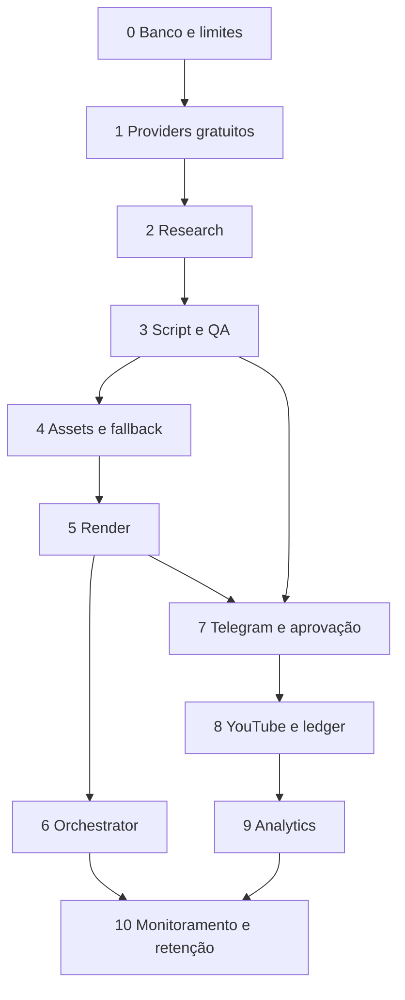

# Plano de implementação e validação — ADR-015

## Ordem de trabalho

O pipeline de publicação não deve ser ativado só porque cinco funções fazem deploy. Esta ordem mantém os estados e reutiliza o core existente. Cada entrega termina com teste isolado; a próxima só depende do contrato aceito, não de reescrever a anterior.

| Ordem | Entrega / funções | Depende de | Situação após auditoria | Critério de aceite |
|---|---|---|---|---|
| 0 | Migrations, permissões, leases, quota, storage e verificação | Nenhuma | Base endurecida, testes SQL executados | Migrations e seed em banco vazio; RLS/roles reais; concorrência; bucket+Vault+extensões cloud; limite por objeto/ocupação. |
| 1 | Clientes texto / model-router / OpenRouter gratuito | 0, schemas/prompts core | Gemini existe; OpenRouter pendente | Modelo obrigatoriamente gratuito e max_price=0 quando suportado; reservas por tentativa; timeouts/backoff; ausência de quota pausa sem billing. Research não ganha grounding automaticamente por usar OpenRouter. |
| 2 | `generate-research` | 0–1 | **Evidência implementada (ADR-017)**; integração Gemini real pendente | Snapshot com partes/citações/consultas; cobertura integral por claim usando offsets UTF-8; fontes derivadas do provedor; promoção atômica e revalidação em script/assets. Validar forma real dos supports no projeto Gemini; revisão factual continua humana. |
| 3 | `generate-script` + QA determinístico compartilhado | 2, contrato Zod | **Implementado (ADR-016)**, validação factual humana pendente | Repair de no máximo1, inclusive JSON malformado; pares sources vinculados à pesquisa; CTA/descrições com disclosure; full_text coerente; padrões configurados bloqueados. Testes de reparo, falha e revalidação em assets. Mapeamento `category → categoryId` fica para publisher. |
| 4 | `generate-assets` e `assets.yml` | 0,3 | Checkpoints e fallback Actions implementados | Pre-flight e cada cena retomáveis; falha no meio troca toda a voz; objetos/referências correspondem; Pexels indisponível gera falha diagnosticável; direitos da imagem comprovados. |
| 5 | `trigger-render` / `render.yml` / renderer | 4 | Implementado e FFmpeg testado com fixture | Render real de episódio representativo; checkpoint após timeout; motion/transition fiel; size≤limite Storage; duração real elegível por destino. Medir CPU/minutos/bytes, não assumir15min. |
| 6 | `orchestrator` | 2–5 | Liga etapas existentes até review | Retomar antes de consumir; ignorar pendências sem duplicar trabalho; backoff persistente para quotas; ausência de um provider não bloquear fila para sempre; incluir tratamento de erros pg_net/Actions. |
| 7 | `telegram-bot` + gate QA/revisão | 3,5,6 | **Implementado (ADRs 018 e 020)**; ativação e teste real pendentes | Webhook secret_token, chat/user permitidos, update_id deduplicado, fingerprint de inputs e ledger atômico. Ficha/anexo, links dos vídeos, fontes, licenças e alertas. Hash dos bytes no caminho final do vídeo. Cadastro, consulta e retirada de ideias implementados (ADR-020). Edição de roteiro via chat continua pendente. |
| 8 | Ledger de publicação + `publish-youtube` | 0,5,7 | **Piloto privado horizontal implementado (ADR-019)**; OAuth e upload real pendentes | Unique por episódio/plataforma/**variante**; lock antes de upload; upload retomável, refresh OAuth, confirmação/reconciliação de resultado ambíguo. Somente upload privado inicial aprovado; flags e descrição corretas. |
| 9 | `collect-analytics` | 8 | **Não implementado** | Coleta por external_id, rate limits e upsert por janela; falha analytics não reenvia vídeo; `published → analyze` somente após persistir dados. |
| 10 | `heartbeat` + retenção/recuperação operacional | 0,6–9 | **Não implementado** | Detectar stalls, leases expiradas, quotas, ocupação Storage, falha de render e publicação incerta. Limpeza pela API Storage, nunca só DELETE em storage.objects; preservar reviews e uploads pendentes. Não prometer que ping impede suspensão free. |
| 11 | `publish-tiktok` / Shop | Revisão de elegibilidade, consentimento,7–8 | **Vetado no desenho privado atual** | Fase1 continua manual. Só retomar API mediante caso de uso aceito e requisitos oficiais; auditoria da API não habilita automaticamente afiliação/Shop. |

Não criar `generate-audio`: `generate-assets` continua dono de `script → assets`. Não duplicar renderer, schema, duração ou gerador ASS. Não criar API pública apenas para contornar revisão do TikTok.



## Contratos a fechar antes de codificar os publishers

1. **Aprovação do objeto exato:** implementada no ADR-018 com snapshot, fingerprint no banco, ledger e URLs dos vídeos contendo SHA-256 dos bytes. Publisher deve conferir aprovação atual antes do upload e reconciliar sessão de publicação. Nunca confiar apenas em usuário/data ou em callback antigo.
2. **Duas variantes YouTube:** a tabela `publishes` atual só diferencia plataforma. Long e Short precisam de chave de variante e unicidade. Uma chamada de upload com timeout não pode ser repetida cegamente; persistir sessão de upload/external_id e reconciliar antes de retentar.
3. **Shorts e duração real:** o mesmo roteiro não garante elegibilidade em todos os destinos. Verificar duração/proporção/metadata após TTS e render. Não acelerar áudio para caber. Caso exceda, pedir revisão editorial antes da aprovação.
4. **Fact-check:** padrões configurados e vínculo literal implementados no ADR-016; snapshot de grounding e vínculo claim/segmento/fonte implementados no ADR-017. Ainda faltam teste Gemini real, leitura das fontes e avaliação semântica. O relatório sempre exige revisão humana; citações do provedor e `qa_passed` determinístico não autorizam publicação.
5. **Disclosures e licenças:** derivar flags dos dados do episódio; incluir divulgação comercial no CTA/descrição, fontes e atribuições. Imagem de produto não implica licença própria. Metadata da API é derivada e validada antes do upload.

## Testar isoladamente versus integrar

| Isolado, sem credenciais reais | Integração obrigatória |
|---|---|
| Zod, hash, timing, ASS e planner; prompts e respostas de provider simuladas | Gemini de projeto sem billing: modelos disponíveis, RPD/RPM/TPM, latência e grounding efetivo |
| Transições, inserts ilegais, retry e gate em PostgreSQL;12 clientes simultâneos | Supabase real: RLS como anon/authenticated/service_role; upload/download/delete em Storage; Vault, pg_cron e pg_net |
| Provider HTTP429/5xx/timeout, budgets e idempotência de handlers | TTS real e falha induzida entre cenas; Edge word boundaries; Piper provisionado; correspondência com Storage |
| FFmpeg real com endpoints mock e fixtures curtas | Actions+Supabase: dispatch legítimo, queue timeout, falta de secrets, retomada de intermediários e comparação visual/sonora |
| Telegram payloads assinados/duplicados simulados; callbacks obsoletos | Webhook Telegram real no chat permitido e negação de outros usuários |
| Ledger de publicação/refresh OAuth simulados | Canal YouTube real, consentimento OAuth, um upload privado aprovado e prova de não duplicação ao repetir callback |
| Analytics repetido e falha parcial simulados | Dados por external_id do vídeo aprovado; sem transformar erro de analytics em novo upload |

## Entregáveis antes do primeiro deploy controlado

- Migrations históricas **preservadas**, mais `20260911000000_audit_hardening.sql`, `20260911010000_research_evidence.sql` , `20260912000000_telegram_review.sql` , `20260912010000_youtube_private.sql` , `20260912020000_youtube_preflight_recovery.sql` e `20260912030000_telegram_idea_queue.sql`. Aplicar antes de implantar os workers atuais. Pesquisas sem evidência e aprovações sem ledger autêntico ficam bloqueadas. [Ativação do Telegram](telegram-review.md).
- `seed.sql` insert-only, `pipeline.enabled=false`, quotas por modelo calibradas no projeto gratuito.
- `verify-migrations.sql`, testes SQL e concorrência; executar contra banco descartável antes do cloud.
- `.env.cloud` fora do Git; GitHub e Supabase secrets devidamente separados. O deploy não deve sobrescrever as variáveis reservadas do runtime Supabase.
- `deploy.sh --check`, scan de segredos, typecheck completo, testes Deno/Node/SQL e fixture FFmpeg.
- Resolver modelos/imports no bundler Supabase real. A tipagem Deno local passou, mas não certifica bundling hospedado.
- Configurar Vault/pg_cron/pg_net e bucket; não agendar heartbeat/analytics inexistentes.
- `deploy.sh --smoke-test`: smoke **somente de infraestrutura**, com checks de autenticação e schema. Não é teste ideia→publicação.
- GitHub Secrets `SUPABASE_URL`, `SUPABASE_SERVICE_ROLE_KEY`; token do dispatch com acesso mínimo necessário ao repositório e Actions write. `GITHUB_TOKEN` do Supabase não é o token efêmero embutido nos workflows.

Exemplo de verificação local:

```bash
npm ci
npm run typecheck
npm test
deno check --config supabase/functions/deno.json supabase/functions/*/index.ts scripts/run-assets.ts
deno test --allow-env --config supabase/functions/deno.json supabase/functions/_shared/
node scripts/test-render.mjs
node scripts/scan-secrets.mjs --history
bash deploy.sh --check
```

Em **banco PostgreSQL descartável**: aplicar `supabase/tests/bootstrap.sql`, migrations em ordem, seed, verificador e `supabase/tests/audit.sql`. O bootstrap só simula a tabela de buckets necessária ao DDL; **não aplicar esse bootstrap no Supabase**. CI demonstra a sequência completa e o teste concorrente. O Supabase CLI local usa Docker; não foi introduzido nesta tarefa.

## Sequência de validação real

1. Operador provisiona Supabase free e credenciais próprias. Confirmar que a chave Gemini aponta para projeto sem billing; medir limites exibidos no AI Studio. Não assumir que uma chave diferente cria cota independente.
2. Rodar deploy e smoke mantendo pipeline pausado; examinar migrations, bucket, Vault e retorno dos workers. Confirmar que anon/user não podem gastar quotas ou escrever objetos.
3. Criar **uma ideia de teste identificada**, habilitar pipeline com cap1, acompanhar `job_events` até review. Depois pausar novamente. Esse teste consome recursos gratuitos e não publica.
4. Induzir falha em uma cena, verificar preservação de checkpoints, consistência de engine, limites de tempo/tamanho e retorno ao estado de origem. Não repetir dispatch se o resultado anterior for incerto.
5. Com QA/Telegram/publisher implementados, aprovar explicitamente o vídeo de teste e fazer um upload **privado** YouTube. Repetir o mesmo callback e comprovar que existe um único external_id por variante.
6. Coletar analytics; verificar falha/retry sem republicação. Só então avaliar habilitar agenda de rotina.

## Critério de “zero bloqueantes”

É uma condição verificável, não uma frase de encerramento: todas as entregas0–10 aceitas, CI verde no commit enviado, secrets/configuração prontos, render real com medidas, gate humano anti-spoof, um upload privado único aprovado e coleta de analytics. Para TikTok, upload manual é o escopo válido desta fase.

Após ADR-019, permanecem bloqueios **de implementação** (QA audiovisual/publicação pública e Shorts/analytics/retention e apresentação dedicada do grounding) e **externos** (cloud, credenciais, quotas, qualidade factual, teste real Gemini e Telegram). Gate humano implementado e testado com HTTP simulado/PostgreSQL. O comando `node scripts/preflight.mjs --production` deve continuar falhando enquanto os módulos obrigatórios não existirem. Não “resolver” isso trocando módulos obrigatórios por opcionais ou preenchendo scores de aprovação fictícios.

Piloto YouTube: [guia de ativação e reconciliação](youtube-private-pilot.md). Upload privado mantém o episódio em review; o processamento e a conferência no Studio são critérios do teste real.
