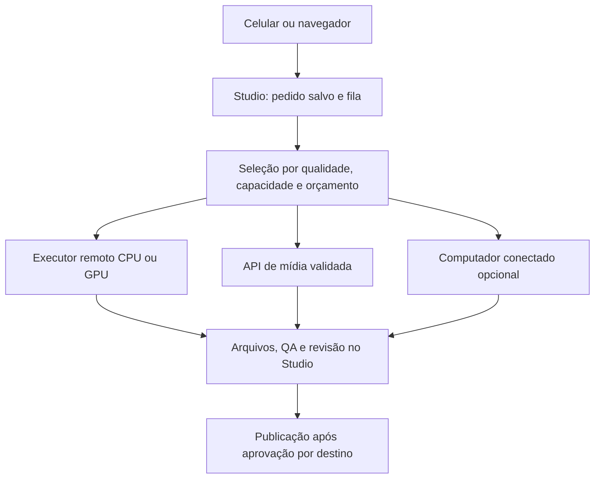

# Produção para celular e computador — arquitetura e viabilidade

Data da pesquisa: 2026-10-05. Escopo: recomendação de arquitetura; nenhuma infraestrutura provisionada ou credencial acessada.

## Decisão recomendada

**Nuvem como execução padrão; dispositivo do cliente como interface; computador conectado como recurso opcional.** A qualidade do conteúdo depende do modo escolhido e da capacidade de produção disponível, não do preço do telefone ou computador do cliente.

O teste Cycles/HIP do ADR-046 comprovou uma possibilidade de desenvolvimento local. Ele não deve se tornar requisito de entrada no produto. A mesma cena Blender pode ser enviada a um executor remoto compatível; uma API de vídeo generativo representa outra técnica e não é um substituto transparente para renderizar essa cena.

A primeira rota remota a validar é um executor próprio em **Modal Functions**, dentro da franquia elegível e com bloqueio de desembolso. Há exemplo oficial de Blender na plataforma. Ainda não existe benchmark remoto deste projeto nem conta/cota verificada nesta pesquisa.

## 1. O que já existe no projeto

- **Isto já existe em `supabase/functions/trigger-render/index.ts` e `.github/workflows/render.yml`:** disparo de render fora do computador do operador. O código atual encaminha o episódio ao GitHub Actions; isso é constatação do repositório, não uma nova verificação operacional da nuvem.
- **Isto já existe em `apps/local-renderer/src/render.ts`:** engine compartilhado executado por CLI, composição de imagens, áudio, legendas e checkpoints. O nome da pasta não obriga execução no PC.
- **Isto já existe em `episode-lease.ts`:** proteção de execução de uma etapa. A migração atual atribui 180 segundos ao lease e `trigger-render` o libera após o dispatch. Isso não é uma reserva durável de um render longo com heartbeat e recuperação entre provedores.
- **Isto já existe no ADR-042/045:** isolamento de workspaces, revisão web/Telegram e histórias opcionais. A revisão no navegador deve continuar disponível a quem usa celular.
- `studio-story/index.ts` informa capacidade estimada de **roteiro** e `animated_available: false`. Tokens disponíveis não demonstram capacidade de render 3D.
- `render.yaml` hospeda o painel, separadamente dos jobs. Não mover render pesado para a requisição HTTP do painel nem para uma Edge Function.

## 2. Por que não decidir apenas por “PC ou celular”

A identificação do dispositivo não mede desempenho sustentado, memória disponível ou compatibilidade do render. O navegador fornece informações parciais: `deviceMemory` é aproximado e limitado por privacidade. WebGPU dá acesso a recursos gráficos compatíveis, mas não executa automaticamente o Blender nativo instalado na máquina. [Memória no navegador](https://developer.mozilla.org/en-US/docs/Web/API/Navigator/deviceMemory), [WebGPU](https://developer.mozilla.org/en-US/docs/Web/API/WebGPU_API).

Abas podem ser congeladas ou descartadas; tarefas podem parar ao alternar aplicativos ou por pressão de memória. A produção não deve depender de manter uma aba aberta. [Ciclo de vida documentado pelo Chrome](https://developer.chrome.com/docs/web-platform/page-lifecycle-api).

No navegador, adaptar a resolução da prévia, o carregamento das miniaturas e os efeitos da interface. Uma prévia mais leve não deve reduzir a resolução do arquivo final. No primeiro acesso, evitar testes de GPU longos e coleta de identificação detalhada do hardware.

## 3. Comparação de execução

| Rota | Papel recomendado | Benefício | Limite real |
| --- | --- | --- | --- |
| Executor remoto próprio, CPU/GPU | Padrão para finalizar vídeos e renderizar cenas 3D | Funciona com o cliente usando celular e mantendo o elenco versionado | Precisa de conta administrativa, cotas, orçamento e benchmark reais |
| API de imagem/vídeo generativo | Provedor por capacidade, habilitado após avaliação | Pode gerar tomadas sem modelar tudo manualmente | Continuidade, licença, duração, áudio e cota precisam ser demonstrados por modelo |
| Aplicativo auxiliar no computador | Opcional, em fase posterior | Aproveita hardware autorizado e pode reduzir uso da nuvem | Instalação, energia, disponibilidade e compatibilidade; não é obrigatório |
| Render pesado na aba | Não será a base da produção | Evita parte do processamento remoto em tarefas compatíveis | Suspensão de abas, dispositivos heterogêneos e necessidade de outro engine |

### Modal: primeiro candidato a teste remoto

O plano Starter inclui US$ 30 mensais de **compute**, compartilhados pelo workspace do provedor. São créditos para GPU, CPU e memória, não uma franquia por cliente do Studio. Excedentes podem gerar cobrança. Shared Endpoints de modelos não entram nessa franquia e, portanto, ficam fora da proposta gratuita. Tempo de inicialização e ociosidade configurada também contam no processamento. [Preços oficiais](https://modal.com/pricing).

A documentação traz um exemplo de Blender executado em CPU/GPU. Isso torna a rota plausível, mas os tempos e o paralelismo do exemplo não são previsões para nossos personagens. Começar com concorrência 1 e sem containers permanentemente aquecidos; comparar pelo custo total de um resultado aprovado. [Exemplo oficial](https://modal.com/docs/examples/blender_video), [controle de escala](https://modal.com/docs/guide/scale).

Antes de rodar qualquer job, verificar o orçamento bruto e o limite de desembolso líquido na conta. O provedor distingue essas duas configurações; créditos não significam bloqueio automático de cobrança. A proposta exige **desembolso máximo zero**, com verificação de que a conta permite/enforça essa configuração, além da reserva interna conservadora. Se essa proteção não puder ser comprovada, a rota permanece desabilitada. Orçamentos por ambiente são de planos superiores; a divisão por cliente do Studio será interna. [Orçamentos e spend limits](https://modal.com/docs/guide/budgets).

### Hugging Face ZeroGPU: complemento experimental

A documentação consultada informa 5 minutos diários de GPU para conta gratuita e suporte voltado a Gradio/PyTorch. Não é uma VM genérica demonstrada para executar nosso Blender. Contas pessoais gratuitas elegíveis podem hospedar até dois Spaces; elegibilidade, modelo e disponibilidade ainda exigem validação. Os minutos são tempo de GPU, não minutos de vídeo produzido. [ZeroGPU](https://huggingface.co/docs/hub/spaces-zerogpu).

A cota utilizada em chamadas autenticadas é a da conta do token. Não multiplicar uma cota administrativa pelo número de usuários do Studio, nem criar contas para contornar limites. Uma conexão individual, se implementada por fluxo oficial de autorização, seria opcional. Não é requisito do cliente comum. [API oficial](https://huggingface.co/docs/hub/spaces-api-endpoints).

### Oracle Always Free: possibilidade de CPU, sem ser prioridade

A documentação atual consultada informa equivalência de 2 OCPUs e 12 GB para Ampere A1 em contas Always Free, sujeita à disponibilidade e recolhimento de instâncias ociosas. Não foi provisionada instância. Não assumir números antigos de 4 OCPUs/24 GB nem inferir GPU gratuita. Exige administração e teste ARM do engine; é alternativa de estudo para processamento CPU, não garantia de render cinematográfico rápido. [Recursos oficiais](https://docs.oracle.com/en-us/iaas/Content/FreeTier/freetier_topic-Always_Free_Resources.htm), [Free Tier](https://docs.oracle.com/en-us/iaas/Content/FreeTier/freetier.htm).

### GitHub Actions: corrigir a rota de expansão

Os termos atuais restringem uso como parte de aplicações serverless e atividades de runners hospedados não relacionadas ao ciclo de desenvolvimento do software. **Minha avaliação arquitetural é não ampliar o workflow atual para oferecer uma central de render aos clientes; planejar migração dos jobs de produção para um executor apropriado e manter Actions para CI.** Não foi solicitado parecer jurídico nem alterado o workflow nesta pesquisa. [Termos oficiais](https://docs.github.com/en/site-policy/github-terms/github-terms-for-additional-products-and-features).

Runners com GPU também são cobrados separadamente e não usam os minutos incluídos comuns. Não constituem GPU gratuita disponível para esta expansão. [Preços de runners](https://docs.github.com/en/billing/reference/actions-runner-pricing).

As Edge Functions do Supabase têm limite documentado de 2 s de CPU por requisição e 256 MB de memória. Seu papel é autenticar, reservar, despachar e reconciliar resultados; render deve acontecer fora delas. [Limites oficiais](https://supabase.com/docs/guides/functions/limits).

## 4. Fluxo proposto

O cliente escolhe tema, estilo, duração e qualidade; o backend escolhe a rota compatível. Um pedido só aparece como aceito depois de persistido no servidor. Fechar o navegador não cancela o processamento remoto. Se um job estiver em computador conectado e essa máquina desligar, o Studio conserva os checkpoints e mostra a espera ou recuperação remota possível, sem prometer capacidade inexistente.

### Política de roteamento

1. Validar acesso ao workspace e congelar versão de roteiro, elenco, voz, cenário e qualidade.
2. Identificar capacidades necessárias: montagem de imagens, render Blender de uma versão específica, geração de imagem/vídeo, TTS e formatos de saída.
3. Selecionar apenas executores testados para esse contrato e autorizados para os dados do job.
4. Consultar disponibilidade, quota com prazo de validade e consumo já reservado, incluindo tentativas em andamento.
5. Priorizar a rota padrão em nuvem; considerar o computador somente se o cliente habilitou essa preferência e ele passou por verificação representativa.
6. Reservar orçamento antes do envio. Falta de saldo mantém a tarefa em espera explicada, sem cobrança, redução silenciosa de qualidade ou tentativa em serviço pago.
7. Guardar identificador do provedor e conferir o resultado antes de repetir um envio cujo recebimento seja incerto.
8. Validar clipes, áudio e arquivos finais, atualizar capacidade e encaminhar à revisão existente.

Compatibilidade vem antes de preço. A mesma cena 3D pode mudar de máquina se versão e recursos forem compatíveis, com comparação visual; não se promete identidade binária entre GPU/CPU diferentes. Trocar de render de cena para vídeo generativo exige uma nova versão visual avaliada. Não misturar rostos ou figurinos de modelos diferentes automaticamente.

“Usar ambos” pode significar CPU remota na montagem e GPU remota nas tomadas, ou máquina autorizada em algumas cenas compatíveis. A divisão só compensa se o ganho superar transferência, inicialização e risco de inconsistência. Não executar a mesma tarefa simultaneamente em duas rotas para ver qual termina primeiro.

## 5. Trabalho durável e integração com o que existe

Preservar os estados do episódio e sua revisão. Criar, em migração futura, registros de execução subordinados ao episódio com etapa, versão, executor, tentativa, reserva, lease renovável, heartbeat e resultado. Esses são estados de execução interna; não novos estados editoriais implícitos.

Usar chave idempotente por workspace/episódio/revisão/etapa/cena/formato/pacote do engine. Um token de posse deve impedir que uma tentativa antiga sobrescreva a nova após expirar. Callbacks duplicados, cancelamento e retomada precisam ser testados. Checkpoints de simulação de cabelo/roupa devem ser pré-calculados e versionados; retomar só um quadro de uma simulação não preparada pode alterar o resultado.

Reutilizar schemas, logger, error-handler, budget guard nas chamadas de IA e job_events. Novos eventos, se necessários, precisam de migração compatível com as constraints atuais. O orçamento de compute deve ser separado do orçamento de tokens.

O executor recebe acesso limitado aos arquivos e ao resultado daquele job. **Não entregar `SUPABASE_SERVICE_ROLE_KEY` a um aplicativo instalado no computador do cliente.** O backend continua responsável por alterações de estado e autorização. Credenciais do provedor permanecem no servidor. Binários, scripts e versões do executor serão controlados pelo produto; uma pauta não se transforma em comando arbitrário.

Um cliente que conecta sua máquina executa somente trabalhos autorizados do seu workspace. Não há compartilhamento de material com computadores de outros clientes. A execução administrativa em nuvem exige isolamento entre jobs e URLs temporárias de acesso, fora de logs públicos.

## 6. Experiência para o usuário

Padrão: **“Produção na nuvem — funciona pelo celular”**. Após aceitar um pedido remoto, mostrar “Você pode fechar esta página; seu vídeo continuará sendo preparado”. Revisão no Studio e Telegram opcional, reaproveitando o fluxo existente.

Mostrar etapas legíveis como “Preparando cenas”, “Produzindo tomadas”, “Montando vídeo” e “Pronto para revisar”. Essas descrições devem vir de eventos reais; uma tarefa apenas enviada ao provedor não pode ser exibida como GPU já renderizando. Exibir progresso por tomadas concluídas; tempo restante somente como estimativa baseada em medições.

Opção avançada futura: **“Conectar meu computador para ajudar na produção”**. Assistente de instalação, pareamento curto, teste de uma cena padrão, limite de uso e botão de pausar/desconectar. Explicar que o aplicativo e a máquina precisam estar ativos. Não iniciar carga pesada sem adesão explícita e não exigir que o cliente conheça API, terminal ou Blender.

O limite de render e a capacidade devem refletir o workspace, o estilo, a duração, a reserva e o gargalo da cadeia completa. Até medir a cena real, exibir “Capacidade em avaliação”, não “2 vídeos restantes”. Tokens de roteiro, minutos de GPU e segundos de vídeo são unidades diferentes. Um aparelho fraco não deve transformar a novela escolhida em um vídeo de imagens sem aviso.

## 7. Zero-budget e capacidade compartilhada

Nenhuma nuvem examinada demonstrou geração cinematográfica ilimitada gratuita para todos os clientes. A proposta é um piloto com franquias, fila justa e limites, ampliável depois se houver infraestrutura financiada. Acesso pelo celular é independente disso; capacidade de geração continua finita.

Implementar uma reserva conservadora por job, com custo de GPU + CPU + memória + inicialização + upload/armazenamento aplicável + tentativas. Medir também o percentual de tomadas reprovadas. O indicador útil é custo por vídeo aprovado, não custo da primeira chamada.

A soma dos limites prometidos aos clientes não pode exceder a franquia do provedor. Reserva global e por workspace precisam ser atômicas. A fila deve evitar que um workspace consuma todos os slots. Não criar contas extras para multiplicar créditos, nem mudar o saldo exibido com base apenas no catálogo de preços. Crédito não verificado na conta não libera produção.

## 8. Ordem de implementação e aceitação

1. Preparar pacote portátil de render e interface de job, aproveitando o engine atual. Definir fingerprint e acesso restrito ao resultado.
2. Validar conta administrativa, franquia e bloqueio de desembolso na rota remota candidata. O cliente final não configura esse provedor.
3. Renderizar a mesma cena curta remotamente e localmente; conferir materiais, áudio, arquivos, tempo, memória, consumo e reexecução. Testar também montagem FFmpeg na CPU.
4. Adicionar dispatch remoto e reconciliação com reserva durável, recuperação e checkpoints. Migrar produção do Actions depois da validação, mantendo CI no GitHub.
5. Testar pelo celular: enviar pedido, fechar a página, voltar depois, revisar e aprovar. Testar clique repetido, provedor indisponível, limite zero, interrupção de worker, callback duplicado e isolamento entre workspaces.
6. Medir a cena humanizada complexa do ADR-046, habilitando o modo animado somente após QA e capacidade real. O teste do cubo não conta para isso.
7. Só depois avaliar o aplicativo auxiliar opcional. Ele melhora custo/velocidade; não é condição para o produto funcionar no celular.

Nesta etapa: código auditado, fontes oficiais consultadas e arquitetura definida. Nenhuma conta criada, chamada de render paga realizada, serviço contratado, cota consumida em GPU remota ou alteração de produção aplicada.
